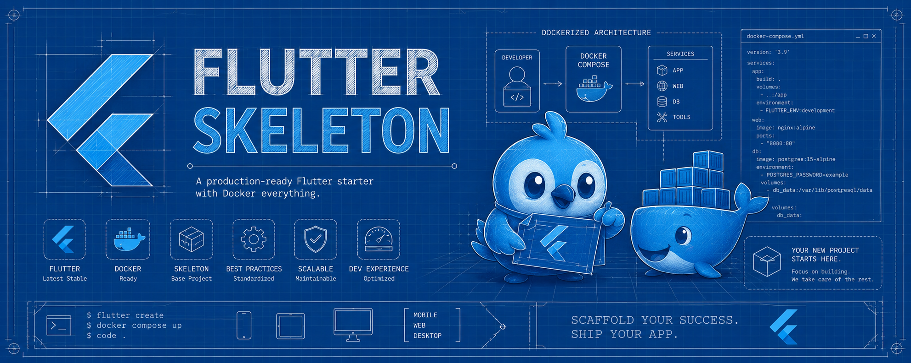

# Flutter Skeleton


**Template opinativo para Flutter**, com ambiente completo em Docker e organização por Feature + DDD já aplicada.

## Sumário

- [Introdução](#introdução)
- [Stack Tecnológica](#stack-tecnológica)
- [Requisitos](#requisitos)
- [Como usar](#como-usar)
- [Documentação completa](#documentação-completa)

## Introdução

O Flutter Skeleton é um **template completo** para começar projetos Flutter de forma rápida e consistente, sem abrir mão de uma arquitetura sólida desde o primeiro commit.

Ele é feito para desenvolvedores — do júnior ao tech lead. A ideia é simples: um dev sênior desenha o padrão uma vez, e qualquer pessoa do time reproduz esse mesmo padrão a cada feature nova, sem precisar decidir do zero como organizar o código.

Tudo roda dentro de um **container Docker** isolado, sem precisar instalar Flutter, Android SDK ou outras ferramentas na máquina host.

> O Skeleton é opinativo. O objetivo é dar uma base rápida e robusta para começar.

## Stack Tecnológica

| Camada | Tecnologia |
|---|---|
| Gerenciamento de estado | [Riverpod](https://riverpod.dev/) (`AsyncNotifier`) |
| Navegação | [go_router](https://pub.dev/packages/go_router) |
| HTTP | [Dio](https://pub.dev/packages/dio) + [Retrofit](https://pub.dev/packages/retrofit) |
| Modelos | [Freezed](https://pub.dev/packages/freezed) + [json_serializable](https://pub.dev/packages/json_serializable) |
| Injeção de dependência | Riverpod (via `Provider`) |
| Logging | [logger](https://pub.dev/packages/logger) |
| Geração de código | [build_runner](https://pub.dev/packages/build_runner) |
| Splash e ícones | [flutter_native_splash](https://pub.dev/packages/flutter_native_splash), [flutter_launcher_icons](https://pub.dev/packages/flutter_launcher_icons) |

## Requisitos

- Linux (testado em Fedora e Ubuntu).
- Docker + Docker Compose v2.
- `git` e `make`.
- Servidor X11 (necessário só para rodar o app como desktop Linux).

> **macOS / Windows**: use WSL2 (Linux) ou adapte o `compose.yml`.

## Como usar

### 1. Criar um novo projeto (recomendado)

```bash
bash <(curl -fsSL https://raw.githubusercontent.com/Diego-Brocanelli/flutter-skeleton/main/install.sh)
```

O script vai:
1. Perguntar o nome do projeto.
2. Perguntar quais plataformas o projeto deve suportar.
3. Clonar, configurar e criar o projeto com a stack completa (Feature + DDD + testes já aplicados).
4. Abrir o shell dentro do container, pronto para desenvolver.

### 2. Comandos do dia a dia

```bash
make up                        # Sobe o container
make shell                     # Entra no container
make analyze                   # Roda a análise estática
make format                    # Formata o código
make new-feature name="Nome"   # Gera uma nova feature completa (lib + testes)
```

Lista completa de comandos: [Comandos Make](docs/comandos-make.md).

## Documentação completa

Guias detalhados ficam em [`/docs`](docs/):

| Documento | Conteúdo |
|---|---|
| [Estrutura do Projeto](docs/estrutura-do-projeto.md) | Como a organização por Feature + DDD funciona aqui, e o que `make new-feature` gera |
| [Usecases e Domain Services](docs/usecases-e-domain-services.md) | Quando e como crescer além do padrão básico |
| [Comandos Make](docs/comandos-make.md) | Todos os comandos disponíveis |
| [Boas Práticas](docs/boas-praticas.md) | Convenções de código (Effective Dart) e o papel do `analysis_options.yaml` |
| [Execução Local](docs/execucao-local.md) | Como rodar o app em cada plataforma suportada |
| [CI/CD](docs/ci-cd.md) | Como funciona o build automático via GitHub Actions |